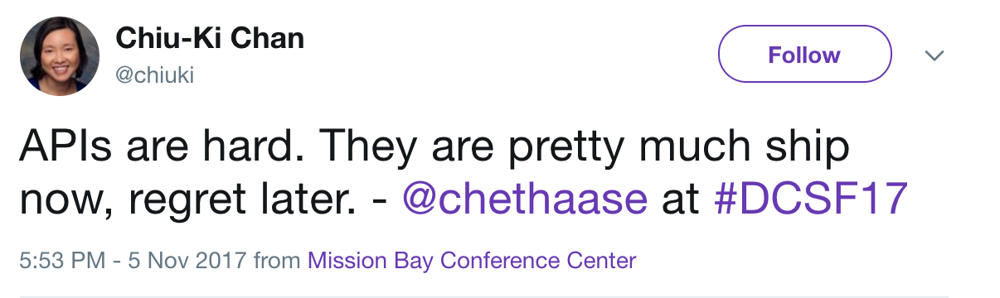
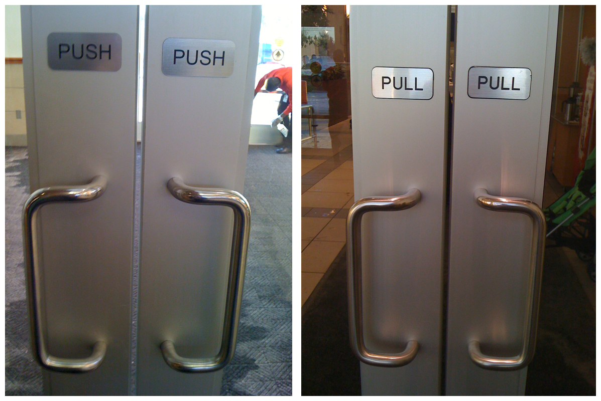
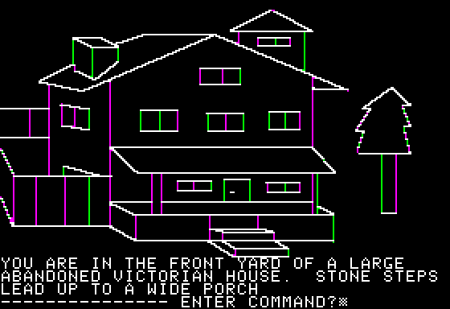
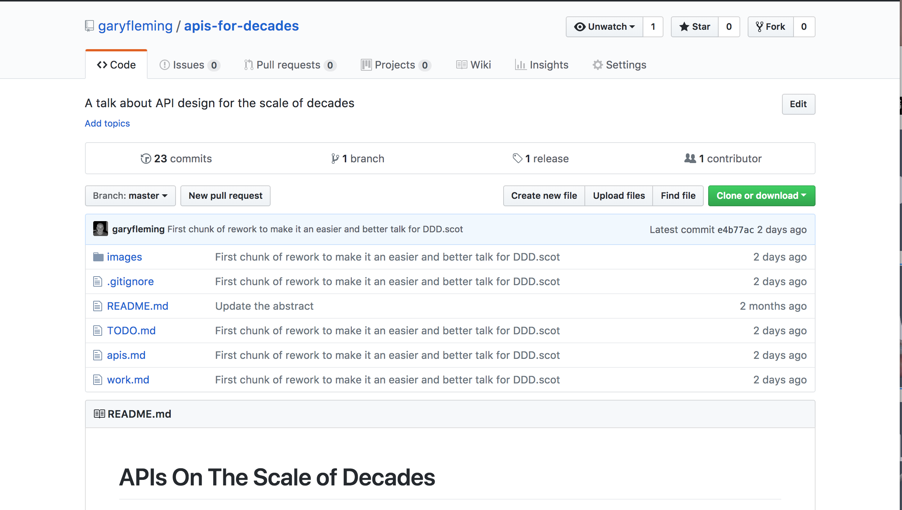

theme: Ostrich, 1

# APIs on the Scale of Decades

## @garyfleming


^ Talk title. Who I am. What I do.

---



^ Saw this near the start of the work on this talk. Seemed an apt problem
statement. How do we change this? How do we make it not regrettable?

---

^  Okay, so I want to talk a bit about some thoughts that I've been mulling over for a few years now on the subject of API design. "A few years" might make you think that I've got some answers to share or some unique insight; so let me start by dissuading you. I don't. There are probably some good ideas in here, and some that are a waste of time.

---

^ So Relax, it's okay. Because this is at least partially a waste of time, you can relieve yourself of the burden of focussing to hear the answers. They won't come. Instead, just let it wash over you and start that thinking process for yourself.

---

^ Really. If we can achieve anything to do, I'd like it to be that we can accept that our API designs to date are not perfect (nothing is), and that with a little time and, crucially, thinking we can improve them just a little bit.

---

# A Long Time Ago...

^ Client created a system. Now "legacy". It's central to a lot of what they do,
making changing it a pain. When they do replace it, they want it to be easier in
the future. They wanted to create an API that would last a long time

---

# Network APIs vs Interface APIs

^ Define each. Mostly I'll be talking about the former. A lot of what I say applies to both, but I'm going to assume we're talking about exposing systems over a network.

---

[.build-lists: true]

# What do we want in an API?

* Machine and human readable
* Changeable
* Testable
* Documented

^ So I asked a number of developers what makes a good API. I got a lot of different
answers but these were the most common answers.
Keep them in mind as we progress.

---

# Part I: What can you Afford?

^ I'm going to talk a little bit about a fairly big idea that underpins most of
what I think will solve the issues in the last slide. But first an example.


---


^ This is Mario. He might be familiar to you.
Mario has a move called the ground pound. He leaps in the air, does a flip, around
slams into the ground with force.

---

 

^ This is a special switch referred to as a ground pound switch. It's never
referred to as such, but that's what it is. You can jump on it normally and
nothing happens. Eventually the idea to ground pound it arrives and it works.

---

 

^ Later you meet this creature. It's called a Mandibug. Unlike the normal enemies,
it doesn't die when you jump on it. You just bounce off.

---

 

^ You notice the star on its back and the star on the switch are similar and,
mostly without engaging your brain, you use the ground pound. Success!

---

# The Star Is a Signal

^ The star is a signal. It's telling us something. Something we know we can do
without being told explicitly "Come and ground pound this."

---

# Affordance

^ Perceptual psychologist James Gibson coined the term affordance in 1966. He used it do describe how an actor (person, animal etc) would see the actional properties of the world around them. Part of nature of the thing: not necessarily visible. Open terrain affords running. Trees afford hiding. They afford climbing. They might afford sustenance to some actors (not necessarily visible!)

---


^ A big cat sees a tree as a thing it can use to hide in, or hunt from, or just
sleep on. It doesn't see it as a source of food.

---


^ Meanwhile, this bird sees it as something it can nest in, but also as a buffet.
The insects line it.

---


^ The sloth. Well the sloth sees the tree as a hammock.

---


^ Note: the sloth seems happiest.

---

# The tree didn't tell them a thing.

^ As affordance, the tree hasn't said anything. It just exists and their own
knowledge and experience leads the animals to their behaviour. It's almost implicit.

---

# APIs tho?


^ Okay, what does this have to do with APIs though? A lot. Give me another few minutes
and we'll get back around to it.

---

# Perceived Affordance

^ Don Norman appropriated the term for his book, "The Psychology of Everyday Things" (1988). He later clarified that he should have used "Perceived Affordance" as his term of art.

---



^ The book, later renamed "The Design of everyday things". It argues for example
that if you've ever experience a set of doors like this where the action needed
and the action perceived are different it's BAD DESIGN. Not user error.

---

# Perception of Affordance

^ Designers care that someone perceives something is possible, and make it so.

^ To draw the line between affordance and perceived affordance, he has argued, for example, that a button on a computer screen affords touching, whether the computer is a touch-screen or not. But what we might care about is whether we believe touching the button will cause an action, and what action that will be.

---


^ So, if you saw this on a button in an app or web page with which you'd interacted, you know what the affordance is. You've been conditioned to see that this is the affordance to save what you have done. (This despite the fact that some of the youngest people here have never seen or held one of these.)

---

[.build-lists: true]


* You don't necessarily save to a disk.
* If you did, it wouldn't be a floppy.
* If it was a floppy disk, it wouldn't just be a drawing.

^ Perceived affordance! This is *very* artificial


---

# Caveat!

^ To be clear, I'm skimming the surface and slightly misusing "affordance" for the sake of simplicity. Please feel free to read more.

---


^ Anyone know who this is?

---

# Roy Fielding


^ This is Roy Fielding. Some of you might know who he is, some might not.

---


> "Architectural Styles and the Design of Network-based Software Architectures."

^ In 2000, Fielding submitted his Doctoral dissertation. It was titled "Architectural Styles and the Design of Network-based Software Architectures." It's a good read; and something that you should read if you haven't because it was where an important idea was first defined.

---

# Representational State Transfer (REST)

^ That idea was REST and, unless you've read his thesis, it's probably quite different than you imagine. Now, I'm not going to try to explain the whole thing because I don't have the time, but let's talk about a few bits.

^ Yes, I know that in this slide the title text is huge and broken up weirdly

---

# rep·re·sen·ta·
# tion·al

^ Aside: if you look up a word in a dictionary it often has these dots. They don't represent pronounciation or syllables. They're actually hinted places to take line breaks in constrained media (YMMV per dictionary). You might call that an affordance, if you knew what they were for.

---

# Fielding and Hypermedia

> "What needs to be done to make the REST architectural style clear on the notion that hypertext is a constraint?"

^ There are a few reasons for that but the most obvious is that REST is defined as a system for distributed hypermedia. The whole thing hinges on it. As Fielding has said many times, Hypermedia Is A Constraint. So... what is it?

---

# Hypertext is...

> "... the simultaneous presentation of information and controls such that the information becomes the **affordance** through which the user [...] obtains choices and selects actions."

^ Do we see the callback there that I so subtly placed a while back? The mechanisms to control information presented AS the information is the pretty radical thing that REST is built around. It's not the only thing, but affordance is really high up the list.

---

# Wut?


^ Okay, I know the last few slides have been fairly information dense. So let me simplify

---

# Information + Controls = Better API

^ Let's make this clear. You put your mechanisms for controlling your API into the information returned by your API. You don't separate them out.

---

## Action contextualises Information contextualises Action

^ Let's say it again: the things you want to say make more sense when
they are contextualised by the actions you can take on theme. I can say that you
have £100 in your account and offer you the ability to transfer it. That contextualises
the money. It's yours to change in particular ways. If you transfer £30, then I can
contextualise that transfer by saying you now have £70.

---

# Codez Example pls


---

[.build-lists: true]

# Collections

* Next, previous, start, end
* Filter
* Sort By...
* Group By...

^ This is the most common place you'll see controls in REST, because it's conceptually simple, very generic, and makes life easier for integrators.

^ When we have large data sets we want to share with the world, we often don't want to just do a huge data dump. We use affordances to offer options for navigating through datasets.

---

# HAL-style

```javascript
{
  "items": {
    ...
  }
    "_links": {
        "next": { "href": "/page=2" }
    }
}
```

^ This is just a quick syntax example. I don't think I've seen any "standard" JSON syntax for this that I particularly like, but some are better than others.

---

# Generic

^ These are really generic collection affordances. It doesn't matter what the underlying items are, the affordances should work. REST puts a lot of emphasise on standard controls when possible.

---

# Text Adventures



^ If you ever played an old text adventure, there will usually a bunch of standard verbs you could use
against the nouns. These were often domain specific. "Go north" was fairly generic, "light fire" might make sensible in an RPG or in something else with fire, "kill dragon" makes sense if you can kill

---


^ "kill-jester" always makes sense

---

# Domain Knowledge is Okay


^ It's fine to use domain specific verbs and nouns to describe affordances. It's okay to expect agents to only understand the controls you're offering alongside the information if they understand the domain itself. You can't expect a sloth to understand killing dragons, but they do understand trees.

---

# Alexa search for...


^ A good way of finding those verbs and nouns is imagining a voice interface. How would you want to ask
Siri/Alexa to do what you want to do?
Offer *that* to your users alongside the info.

---

> Alexa buy a hoppy beer for Gary


---

# Affordance is Documentation

^ So I've talked a lot about affordance and controls because I think it underpins most of everything else. If the way we use something is also its documentation, that's a powerful idea.

---

# Part II: Change

^ One of the other things people wanted was for things to be safe to change. How do we do that?

---

[.build-lists: true]

# Ship of Theseus

* Mereological theory of identity
* Spatio-temporal continuity theory


^ Story.... Mereological suggests that it's a new ship. Sum of its part. Change the parts, Change the thing.
Spatio-temporal continuity theory - "Object can maintain its identity as long as the change is gradual and the form or the shape of the object is preserved through the change of its components materials."

---

# It's a Versioning Problem

^ The ship of Theseus is a versioning problem, or we can at least see it through that lens.
When do your changes take you from V1 to V2?

---

# Bullet Trains


^ Tunnels, sonic booms, re-engineering. Kingfishers. No splashes. No sonic boom.

---

# Biomimicry

^ We know that we can see incredible designs in nature. Evolution has produced some fantastic fits
for what makes sense to us. I'm going to suggest we mimic an aspect of evolution: ignore numbers and
constantly change.

---

# Owl V2


^ There was no owl v2. Or v3. Instead we had simple birds becoming more specialised over Time
until we had the owls we have today. The owls in a millenium from now will be different. They'll still
be owls.

---

# Affordance Trumps Versioning

^  if we present the controls we can use on a piece of information as part of that Information
then we don't need versions. We just change the affordance we make available.

---

# NO VERSION?


^ Now I know some of you will be freaked out by this. Surely we need versions to keep everything working?
How will we know what we can do?

---

# You Deal With This Every Day



^ You visit web pages and deal with the links they throw up. You never concern yourself with whether you're viewing google V1, v2, or v1000000.
You care about how you can apply your domain knowledge to the information and controls you can see. You do it
with ease.

---

# Change Is Inevitable So Change

^ Change is inevitable, so prepare for it. Expect it. Don't want.
Build for change. Think about how you'd build robustness when you know
the world will change.

---

# PART III: Testing


^ Why do cars have brakes? So they can go faster.
APIs have tests so they can change faster.

---

# Build for change


^ If we're saying that change is inevitable, then plan for it. Tell integrators that you absolutely will make changes slowly and certainly. In an internal org API, that shouldn't be much of an issue. You even have a great tool at your disposal...

---

# Consumer-Driven Contracts

^ If your org controls both ends of the wire, then write CDCs. These are tests that the client gives you detailing its expectations of how your API should work and the parts it cares about. The consumer can run against these expectations and ensure it's behaving correctly.

^ They can also give the expectations to you, so you can run them when you make changes. Something breaks? Now you know what consumer you need to speak to about how you can progress together.


---

[.build-lists: true]

# Fuzzers

* Modify parts without contract coverage
* Scramble links
* Add in dummy data

---

# Break Assumptions. Think Affordance.

^ Do anything you can to break people's assumptions about what will and won't change about an API.
Force them to think in affordance.


---

# PART IV: A NEW OLD API

^ So far I've argued for affordances, presenting information and tests together.

---

# What do we want in an API?

* Machine and human readable
* Changeable
* Testable
* Documented

^ I've argued as well as I'm going to that APIs that are afforded are changeable,
and testable. They're documented because they are themselves documentation on their
own usage.

----

# Anything Else We Want?

* Easy to Navigate
* Easy to Update Data
* Compressable
* Lightweight Structures
* Optional Types
* Existing tooling

---

# The Forms of Things


^ So we want APIs that have affordance in terms of hypermedia. There are different kinds of hypermedia control that act as affordance.
Hyperlinks act as ways of moving between data, as connection (where that connection could have meaning). But there's this other affordance we care about where we want (lightweight?) ways of knowing the structure of resources we want to talk about.

---

# Example: Person

* Given Name
* Family Name
* Email
* Birth Date
* Address

^ a Person has a name which is text, an age that is represented by a date, etc
It's vital that we understand the form of a thing.

---

# JSON... why?

^ JSON, natively, doesn't have a hypermedia link type. Various standards exist to try to patch that in, but it's missing. JSON doesn't have forms. Various standards exist to try to patch that in (but are shonkier).

---

# XML Was Problematic

[.build-lists: true]

* Verbose
* No real structures
* Arbitrarily complex and extensible
* etc

^ verbose, no structures in the data structures sense, namespaces and complexity could make it hard to reason about.
But it was better than the proprietary, closed standards that came before it.

---

## What solves the problem?

^ What solves the problems of both XML and JSON?

---

# HTML5 has it All


---

# HTML5 has it All


[.build-lists: true]

* Links
* Forms
* Structures
* Types
* Tooling

^ It has everything you'd want. Links (we call them links), forms (called forms), structures (lists, maps/dicts etc), types (microdata), great tooling.
An HTML5 API is its own tooling! Point a browser at it and it'll work just fine.

---

# You Deal With This Every Day


^ Those links, the forms, the domain knowledge. You deal with it every single day. GitHub **is** an API. It's an
interactive toolset.
You have domain knowledge. You can figure it out.
^ The simultaneous presentation of information that is part of a domain that you understand, and the controls to manipulate that information affords you the ability to act robustly.

---

# Write Your APIs using HTML5


---

# FOR SRS?


^ Am I seriously arguing for it? Hmmm... maybe... dunno. What argument would you have against it?
This talk is about thinking and ideas. So other than "that's not what we do", why not? How would you make it robust?


---

# Thank You


## @garyfleming

---

# Thank You

## @garyfleming

## github.com/garyfleming/apis-for-decades/

^ The github repo has links and resources including some videos of people building hypermedia aware APIs. They're XHTML based, because they're a little older, but HTML5 is the way to go.
